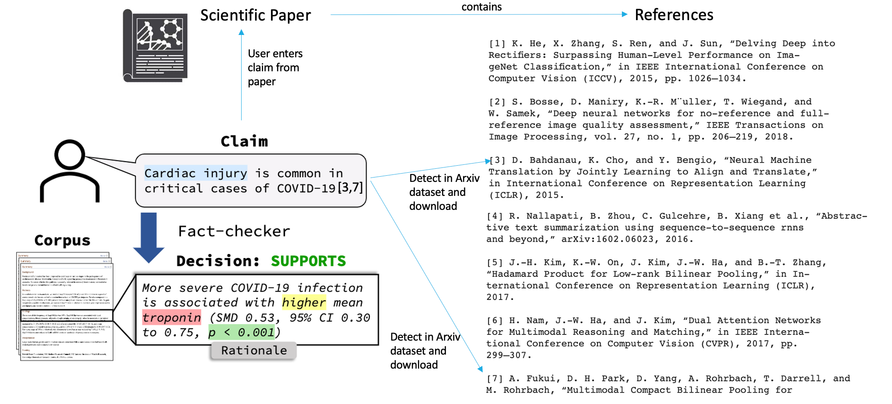

###### **INTRODUCTION**

The recent increase in misinformation has stimulated research in fact checking, which is the task of assessing the truthfulness of a sentence or a claim.
Companies such as Facebook and Twitter are prioritizing the implementation of fact checking algorithms to decrease the spread of fake news.

I am trying to solve a similar problem but in the domain of scientific literature. 
Due to rapid growth in the scientific literature, it is difficult for researchers and the general public even more so, to stay up to date on the latest findings. This challenge is especially acute during public health crises like the current COVID-19 pandemic. This is due to the extremely fast rate at which new findings are reported and the risks associated with making decisions are based on outdated or incomplete information. 
I am building a tool to assist researchers and the public in evaluating the correctness of scientific claims.

Understanding the problem

Fig 1

The task is to select abstracts from the research literature containing evidence that SUPPORTS or REFUTES a given scientific claim, and to identify rationales justifying each decision.

If you look at the Fig 1 above, the scientific paper contains references from numbers 1-7.
On the left of the figure, you can see that the scientific paper contains a sentence that says ”Cardiac injury is common in critical cases of covid 19." It contains the citation numbers 3 and 7 within the sentence. 
The user wants to verify the correctness or veracity of this claim.

This project will detect the citations within this sentence, i.e it will automatically detect that the 3rd and 7th references have been cited, will download these cited documents automatically from the internet and then utilizes the pre-trained models to check if the veracity of the claim.
There are 2 models that will be required for this project:
1) The first model is the Rationale Selection Model: 
   This will look at the claim and select sentences from the cited documents that closely correspond to it. Here on the left, you can see that the rationale selected is “More severe Covid 19 infection…”
2) The second model is the Label Prediction Model: 
   This model will look at the sentences selected by the Rational Selection Model and will tell you if the sentences approve or deny the claim. On the left of the diagram, you can see that the rationale sentence selected supports the claim. This is the decision of the model.

