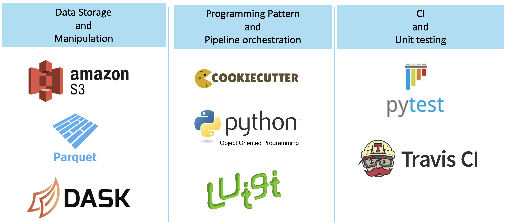
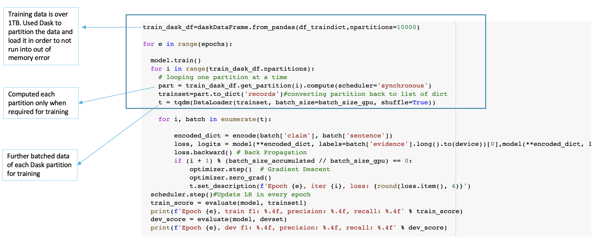

ADVANCED PYTHON CONCEPTS
************************

Fig 3

Several advanced python concepts have been used to build the workflow.

Programming Pattern and Pipeline Orchestration:
Cookiecutter to easily spin up the project.
Luigi is a package that helps you build complex pipelines of batch jobs. Luigi has been used to handle dependency resolution to ensure that one task runs after the other is completed, workflow management and command line integration.

Data Storage and Manipulation:
Amazon S3 has been used to store and retrieve data and the pretrained models. The models and data are downloaded by a luigi task.
Once the data is downloaded as a part of the luigi pipeline, it is partitioned and preprocessed using Dask. The data is originally a json file and not all columns are required.
In addition to S3 and dask, classes and OOP concepts have been used to implement the different functions such as preprocessing using dask and tokenizing text for the model.

Unit-testing and Continuous Integration:
It is essential that the project have substantial unit test coverage. Mocking and decorators have been used during testing to ensure that the functionality works as expected.
Travis has been used as a continuous integration system to build and test the project that is hosted on GitHub. Travis automatically detects when a commit has been made and pushed to a GitHub repo and each time this happens, it will try to build the project and run tests.

**DASK IN DETAIL**

The size of the original data that was used to train the rationale_selection and label_prediction models was over 1TB.
The two models have been originally trained on google cloud for better computational prowess, but due to the mere size of the dataset, the system was running into RAM out of memory error.
This is when dask came to the rescue. The dataset was partitioned into 10000 parts and each part was only computed as required right before training the model.
In the code displayed in Fig 4, you can see that a loop over all partitions and each partition is computed after the previous partition has been trained.
