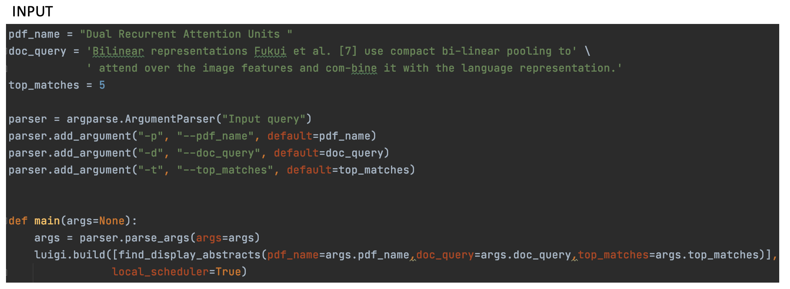
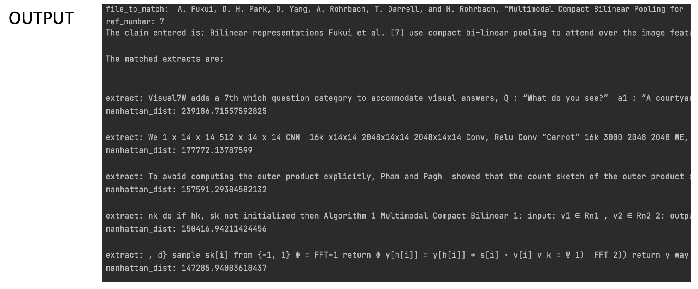

RESULTS
*******

The input section displays the inputs given by the user. The output section displays the output of the program.
The doc-query is the claim the user wants to verify. Notice that the user enters a sentence that has [7] within the sentence as a citation. The program must be capable of detecting this [7] as a citation, find its relavant author-name and pdf title using the References section of the cited document, download this document and pass it on the models.

In the output, you can see the cited document is the 7th one in its references and the name of the cited document is printed clearly.
The user wants to display the top 5 results and these can be seen in the output.

The selected abstracts are not very refined as the models require finetuning to remove scientific jargon and formulas from the output.
The success of this project lies in the fact that luigi tasks run in a seamless manner and the user receives a preliminary result.
