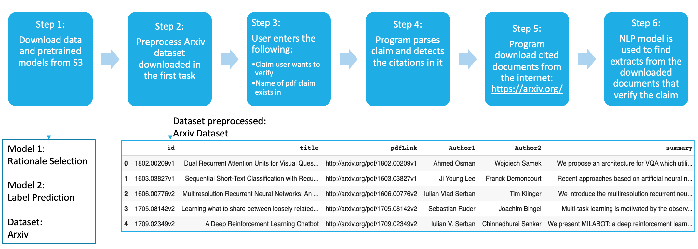

WORKFLOW
********

Fig 2

The step by step workflow is displayed in Fig 2 above. The following outlines the process in detail:

Step 1: Download the model and dataset.
The two models are Rationale Selection and Label Prediction. We also download a dataset called the Arxiv dataset.

Step 2: Preprocess the arxiv dataset.
Arxiv is an open-access repository which hosts all the scientific papers. The arxiv dataset primarily contains information of all the scientific papers such as their titles, authors and links to download the papers.
If the user wants to verify a claim containing a citation to a paper called “Dual Recurrent Attention Units”, the program will first look this up in this dataset. You can see that the title corresponds to the fist item in the dataset in Fig 2 above. The program will then use the "pdflink" found in the dataset and download the document automatically from the internet.
Downloading only the required pdfs that are cited within the claim/query helps save search time and space.

Step 3: Capture User Input
The user enters the claim(which is a sentence) to be verified.
The user also enters the name of the scientific paper this claim exists in and the number of top matched abstracts the user would like to view.

Step 4: Program parses user input
The program parses the user input, preprocesses the claim and recognizes the citations within it using regular expressions. There are multiple ways to cite a document. The citations such as [int,int..] work with this project where each int can be referenced to a document by parsing the References section of a scientific document.

Step 5: Download cited documents
The program looks up these citations in the arxiv dataset and downloads them.

Step 6: Implement models and find abstracts that verify the claim
The program uses the pretrained models to find relevant sentences that support the claim and also display the results to the user.

